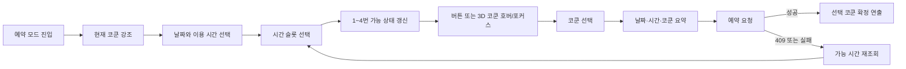

# 코쿤 1~4 인터랙티브 3D 예약 데모 상세 설계

## 1. 설계 결정 요약

- 운영 대상 코쿤은 왼쪽부터 **1, 2, 3, 4번**이다.
- 키오스크 ID가 현재와 같이 `A02~A05`라면 운영 번호는 `A02→1`, `A03→2`, `A04→3`, `A05→4`로 매핑한다.
- 예약 화면의 실시간 상호작용은 **React Three Fiber + Three.js**로 구현한다.
- Manim은 런타임 선택 UI에 사용하지 않는다. 필요하면 홍보 영상이나 설명 영상의 사전 렌더링에만 사용한다.
- 1차 데모는 최종 건축 모델 없이 기본 3D 도형으로 코쿤 한 동을 만든 뒤 4개 복제한다.
- 최종 버전은 동일한 상태/이벤트 코드를 유지하고, 절차형 모델만 최적화된 GLB로 교체한다.
- Anime.js는 1차 데모에 추가하지 않는다. 기존 `framer-motion`, R3F의 `useFrame`, 감쇠 보간으로 충분하며 의존성과 애니메이션 소유권을 단순하게 유지할 수 있다.

## 2. 사용자에게 남겨야 할 한 가지 인상

> “지금 내가 어느 코쿤에 있고, 다음에 어느 코쿤을 예약하는지 공간적으로 한눈에 알겠다.”

목표는 화려한 3D 자체가 아니다. 사용자가 방 번호를 읽고 다시 조감도에서 위치를 찾는 인지 작업을 없애는 것이 핵심이다.

## 3. 데모 범위와 완성본 범위

### 3.1 1차 데모

1차 데모는 실제 예약 종료 화면 안에서 다음을 확인한다.

- 코쿤 1~4의 고정된 공간 배치
- 현재 위치의 상시 표시
- 텍스트 버튼과 3D 코쿤의 양방향 호버/포커스 동기화
- 터치/클릭 선택과 선택 상태 유지
- 선택한 시간에 예약 가능한 방과 불가능한 방의 구분
- 예약 확정 전 선택 요약
- `prefers-reduced-motion`과 WebGL 실패 시 안전한 대체 화면

절차형 모델은 흰색 둥근 외장, 짙은 프레임, 반투명 문, 내부 테이블 정도까지만 표현한다. 최종 재질을 흉내 내는 데 시간을 쓰기보다 인터랙션의 자연스러움과 정보 전달을 검증한다.

### 3.2 최종 완성본

- 설계사 또는 조감도 제작사에서 받은 원본 3D 모델을 Blender에서 정리
- 코쿤, 바닥, 벽, 창, 가구를 GLB로 내보내기
- PBR 재질, 라이트맵 또는 가벼운 실시간 조명 적용
- 키오스크 GPU에서 성능 측정 후 메시와 텍스처 최적화

## 4. 화면 구조

예약 모드의 현재 `max-w-3xl` 모달은 3D 장면을 담기에 좁다. 예약 모드에서만 최대 너비를 약 `1180px`로 확장하고, 선택 화면은 좌우 2단으로 구성한다.

```text
┌──────────────────────────────────────────────────────────────┐
│ 다음 예약 일정 잡기                          현재 코쿤 2     │
│ 날짜 · 이용 시간 · 시간 슬롯                                  │
├──────────────────────┬───────────────────────────────────────┤
│  2026. 09. 03        │                                       │
│  30분                 │       고정 카메라 3D 조감도           │
│                       │                                       │
│  14:00  14:30  15:00 │       [1] [2] [3] [4]                 │
│                       │            ↑ 현재 위치                │
│  예약 가능한 코쿤     │                                       │
│  [1] [2] [3] [4]     │   호버/선택 방이 들어 올려지고 강조    │
│                       │                                       │
│  선택: 15:00 · 3번    │                                       │
├──────────────────────┴───────────────────────────────────────┤
│ 이전                              이 일정으로 예약            │
└──────────────────────────────────────────────────────────────┘
```

### 반응형 규칙

| 화면 | 구성 | 3D 뷰포트 |
|---|---|---|
| 1440px 이상 | 좌측 38%, 우측 62% | 최소 높이 430px |
| 1024~1439px | 좌측 42%, 우측 58% | 최소 높이 360px |
| 1023px 이하 | 세로 배치 | 높이 300~340px |

키오스크의 주 화면을 우선하되 브라우저 개발 및 노트북 검증이 가능하도록 세로 배치도 유지한다.

## 5. 사용자 흐름



### 진입 시

- 장면은 450~600ms 동안 흐림이 걷히며 나타난다.
- 현재 코쿤은 다른 방보다 먼저 선명해지고, 바닥 링과 `현재 위치 · 코쿤 n` 라벨이 표시된다.
- 카메라는 회전하지 않는다. 공간 인지를 방해하는 인트로 비행 애니메이션은 사용하지 않는다.

### 시간 선택 전

- 네 코쿤 모두 공간 참조용으로 보인다.
- 현재 코쿤만 청록색 위치 링을 유지한다.
- 아직 가용성 데이터가 없으므로 방을 선택할 수 없고, 안내 문구는 `먼저 이용 시간을 선택해 주세요`로 표시한다.

### 시간 선택 후

- `availableRooms`에 포함된 방만 선택 가능하다.
- 불가능한 방도 공간상 위치는 유지하되 채도를 낮추고 `예약 마감` 상태로 표시한다.
- 예약 가능 버튼을 호버하거나 키보드 포커스하면 같은 번호의 3D 코쿤이 강조된다.
- 3D 코쿤을 호버하면 같은 번호의 DOM 버튼이 강조된다.
- 3D 코쿤 또는 버튼을 클릭/탭하면 선택 상태가 고정된다.

### 예약 확정 시

- 선택 코쿤의 테두리가 파란색으로 고정되고 체크가 나타난다.
- 카메라는 선택 코쿤 방향으로 화면 폭의 2~3%만 이동하고 1.03배 정도만 당긴다.
- 요청 중에는 선택을 변경하지 못하며 과장된 스피너 대신 버튼 내부 진행 상태를 사용한다.
- 서버 확정 응답을 받은 뒤 700~900ms의 짧은 확정 연출을 보여 주고 기존 완료 화면으로 전환한다.

## 6. 상태 모델

```ts
type CocoonNumber = 1 | 2 | 3 | 4;

type CocoonSelectorState = {
  currentRoomNumber: CocoonNumber;
  availableRoomNumbers: Set<CocoonNumber> | null;
  hoveredRoomNumber: CocoonNumber | null;
  focusedRoomNumber: CocoonNumber | null;
  selectedRoom: AvailableRoom | null;
  submitting: boolean;
};
```

`hoveredRoomNumber`는 마우스와 3D 포인터의 임시 상태이고, `focusedRoomNumber`는 DOM 버튼의 키보드 포커스 상태다. 장면이 강조할 임시 대상은 다음 우선순위로 계산한다.

```ts
const previewRoomNumber = hoveredRoomNumber ?? focusedRoomNumber;
```

선택 상태와 현재 위치 상태는 임시 미리보기와 별도로 유지한다. 예를 들어 현재 코쿤 2에서 코쿤 4를 호버하면 2번의 작은 위치 링은 남고 4번만 크게 들어 올라온다.

## 7. 시각 상태 규칙

| 상태 | 코쿤 본체 | 바닥/외곽선 | 라벨 | 동작 |
|---|---|---|---|---|
| 기본 가능 | 정상 재질 | 얇은 중성 외곽선 | `코쿤 n` | 선택 가능 |
| 현재 위치 | 정상 재질 | 청록 링, 약한 내부광 | `현재 위치 · 코쿤 n` | 다른 상태와 병존 |
| 호버/포커스 | 1.025배, 6cm 상승 | 밝은 파랑 외곽선 | `코쿤 n 선택` | 포인터 아웃 시 복귀 |
| 선택 | 1.02배, 4cm 상승 | 진한 파랑 외곽선과 체크 | `선택됨 · 코쿤 n` | 확정 전까지 유지 |
| 예약 불가 | 채도 35%, 밝기 70% | 회색 점선 링 | `예약 마감` | 클릭 불가 |
| 제출 중 | 선택 상태 유지 | 느린 1회 진행 링 | `예약 확인 중` | 전체 입력 잠금 |

### 색상 토큰

```css
--cocoon-scene-bg: #EDE8E1;
--cocoon-floor: #D8CFC3;
--cocoon-shell: #F7F5F1;
--cocoon-frame: #252525;
--cocoon-current: #22C7D6;
--cocoon-hover: #60A5FA;
--cocoon-selected: #2563EB;
--cocoon-unavailable: #A1A1AA;
--cocoon-label-bg: rgba(21, 36, 58, 0.88);
```

현재 화면의 예약 CTA가 사용하는 파랑을 선택 색으로 유지한다. 현재 위치는 선택과 혼동되지 않도록 청록색을 사용한다.

## 8. 3D 장면 설계

### 카메라

- `PerspectiveCamera`, FOV 26~30도
- 정면보다 약간 높은 조감 시점
- 코쿤 4개가 항상 한 프레임에 들어오도록 고정
- OrbitControls 미사용
- 마우스 이동 패럴랙스는 최대 좌우/상하 0.6도만 허용하고 터치 환경에서는 비활성화
- 방 호버 시 카메라를 개별 방으로 이동하지 않는다. 선택 확정 때만 미세 이동한다.

### 장면 구성

```text
CocoonScene
├─ CameraRig
├─ EnvironmentLights
│  ├─ HemisphereLight
│  ├─ KeyDirectionalLight
│  └─ SoftFillLight
├─ RoomShell
│  ├─ Floor
│  ├─ BackWall
│  ├─ SideWalls
│  └─ WindowPlane
└─ CocoonPod × 4
   ├─ HitArea
   ├─ OuterShell
   ├─ DarkFrame
   ├─ GlassDoor
   ├─ Table
   ├─ NumberLabel
   ├─ HighlightShell
   └─ FloorHalo
```

`HitArea`는 보이는 메시보다 조금 큰 투명 박스로 둔다. 유리문과 프레임 사이의 빈 공간에서도 호버가 끊기지 않게 하기 위해서다.

### 절차형 데모 모델

- `RoundedBox` 기반 외장과 프레임
- 유리문은 낮은 불투명도와 높은 roughness로 처리해 과한 투명 렌더 비용을 피한다.
- 내부는 테이블과 의자 실루엣 정도만 표현한다.
- 한 개의 geometry/material을 네 인스턴스가 공유한다.
- 코쿤 중심 좌표는 좌측부터 `[-4.5, -1.5, 1.5, 4.5]` 계열로 고정한다.

### 최종 GLB 노드 규약

```text
Scene
├─ room_shell
├─ cocoon_01
│  ├─ shell
│  ├─ frame
│  ├─ glass
│  └─ furniture
├─ cocoon_02
├─ cocoon_03
└─ cocoon_04
```

노드 이름으로 방 번호를 추측하지 않고, 로더에서 명시적인 `roomNumber → nodeName` 맵을 사용한다. 모델 제작 과정에서 이름이 바뀌어도 예약 도메인 로직에 영향을 주지 않게 하기 위해서다.

## 9. 모션 상세

| 이벤트 | 시간 | 이징/물리 | 값 |
|---|---:|---|---|
| 장면 진입 | 550ms | ease-out | opacity 0→1, scale 0.985→1 |
| 현재 위치 표시 | 380ms | spring, 낮은 overshoot | 링 0.7→1 |
| 현재 위치 호흡 | 1800ms | sine 반복 | 링 opacity 0.35↔0.55 |
| 호버 진입 | 220ms | critically damped | y +0.06, scale 1.025 |
| 호버 해제 | 280ms | critically damped | 원위치 |
| 선택 고정 | 320ms | spring | scale 1.02, 외곽선 전환 |
| 확정 카메라 | 520ms | easeInOutCubic | target 소폭 이동, zoom 1.03 |
| 완료 체크 | 650ms | spring | 0.8→1, 1회만 |

애니메이션은 `delta` 기반 감쇠 보간을 사용해 프레임률이 달라도 속도가 일정하게 느껴지게 한다. 코쿤을 계속 회전시키거나 바운스시키는 연출은 사용하지 않는다.

`prefers-reduced-motion: reduce`에서는 다음을 적용한다.

- 반복 호흡과 포인터 패럴랙스 제거
- 카메라 이동 제거
- 상승/스케일 대신 120ms 색상과 외곽선 전환만 사용

## 10. 프런트엔드 컴포넌트 설계

```text
ReservationEndOverlay
└─ BookingPanel
   ├─ BookingScheduleControls
   ├─ TimeSlotList
   └─ CocoonSelector
      ├─ CocoonSceneCanvas
      │  └─ CocoonScene / CocoonPod
      ├─ CocoonRoomButtons
      ├─ SelectionSummary
      └─ StaticCocoonFallback
```

권장 파일:

```text
src/features/reservationFollowup/
├─ ReservationEndOverlay.tsx
├─ CocoonSelector.tsx
├─ CocoonSceneCanvas.tsx
├─ CocoonScene.tsx
├─ CocoonPod.tsx
├─ cocoonSceneModel.ts
├─ cocoonSceneMaterials.ts
└─ CocoonSelector.test.tsx
```

`ReservationEndOverlay`가 예약 데이터와 선택 상태를 소유한다. `CocoonSceneCanvas`는 시각 렌더러일 뿐 API 요청이나 예약 정책을 알지 않는다.

권장 props:

```ts
type CocoonSelectorProps = {
  currentRoomNumber: CocoonNumber;
  rooms: AvailableRoom[];
  selectedRoom: AvailableRoom | null;
  disabled?: boolean;
  onSelect: (room: AvailableRoom) => void;
};
```

3D 장면은 `rooms`에 없는 1~4번도 렌더링한다. `rooms`는 공간 목록이 아니라 선택 가능 목록이기 때문이다.

## 11. 백엔드 계약과 번호 체계

### 단일 운영 매핑

```py
KIOSK_ROOM_MAP = {
    "A02": 1,
    "A03": 2,
    "A04": 3,
    "A05": 4,
}
```

키오스크 ID와 코쿤 번호가 다르다는 사실을 숨기지 말고 명시적인 맵으로 관리한다. 프런트에서 `A02`의 숫자를 잘라 방 번호를 계산하면 안 된다.

### 세션 응답 추가 필드

```json
{
  "reservationId": 154,
  "kioskId": "A02",
  "currentRoomNumber": 1,
  "status": "ended"
}
```

프런트 `UsageSession`에도 `currentRoomNumber: 1 | 2 | 3 | 4`를 추가한다. 백엔드의 `UsageSession.room_number`를 직렬화하면 되므로 별도 조회는 필요 없다.

### 가용 방 계약

- `availableRooms`는 코쿤 1~4만 반환한다.
- 항상 `roomNumber` 오름차순으로 정렬한다.
- 방 번호와 DB `roomId`는 분리해 유지한다.
- 예약 요청은 기존처럼 `roomId`를 전송한다.
- 제출 순간 충돌이 발생하면 서버 `409`를 최종 권위로 보고 가용성을 재조회한다.

## 12. 접근성 및 입력 방식

- DOM의 `코쿤 1~4` 버튼은 유지한다. 3D Canvas만으로 선택 UI를 만들지 않는다.
- 버튼에는 `aria-pressed`, 예약 불가 시 `disabled`, 현재 위치에는 보조 설명을 제공한다.
- 장면의 동일 기능은 스크린리더에서 중복 탐색되지 않도록 Canvas를 장식 영역으로 취급한다.
- 3D 클릭은 동일한 `onSelect`를 호출하지만 키보드 사용자는 DOM 버튼으로 모든 기능을 수행할 수 있다.
- 선택 변경 시 `aria-live="polite"` 영역에서 `코쿤 3번을 선택했습니다`처럼 알린다.
- 키오스크에서는 hover가 없으므로 첫 탭이 곧 선택이다. 선택 결과는 최소 44px 이상의 버튼과 장면 양쪽에서 즉시 보인다.

## 13. 성능 예산

| 항목 | 데모 목표 | 최종 목표 |
|---|---:|---:|
| 초기 3D JS 추가량 | 기존 의존성 재사용 | 별도 대형 애니메이션 라이브러리 없음 |
| GLB | 없음 | 압축 후 5MB 이하 권장 |
| 삼각형 | 50k 이하 | 150k 이하 |
| draw call | 50 이하 | 80 이하 |
| DPR | `1~1.5` | 기기 측정 후 고정 |
| 프레임률 | 60fps 목표, 30fps 하한 | 운영 키오스크 45fps 이상 권장 |
| 텍스처 | 절차형 색상 | 최대 2K, 가능한 KTX2 |

- Canvas는 예약 모드에서만 마운트한다.
- 데모 모델의 geometry와 material은 공유한다.
- 그림자는 코쿤 전체가 아니라 핵심 메시만 cast한다.
- 실시간 bloom, SSAO, 깊은 투명 중첩은 1차 데모에서 제외한다.
- 장면 로딩이 예약 API나 DOM 컨트롤을 막지 않게 동적 import와 Suspense를 사용한다.

## 14. 실패 및 대체 처리

WebGL 생성 실패, 컨텍스트 유실, 모델 로딩 실패가 예약 기능 실패로 이어져서는 안 된다.

대체 화면은 제공된 조감도 PNG를 배경으로 사용하고 코쿤 1~4 위치에 SVG/HTML 히트 영역과 강조 레이어를 올린 2.5D 버전으로 구성한다. 선택 로직과 DOM 버튼은 동일하므로 예약은 계속 가능하다.

```text
3D Canvas 정상 ──> 실시간 3D 장면
       │
       ├─ WebGL 실패
       ├─ GLB 실패
       └─ 컨텍스트 유실 ──> 정적 조감도 + 2.5D 강조
```

## 15. 기능 플래그

```env
NEXT_PUBLIC_COCOON_3D_BOOKING_ENABLED=true
NEXT_PUBLIC_COCOON_3D_DEBUG=false
```

- 운영 배포 전 기존 텍스트 선택 UI와 즉시 전환할 수 있게 한다.
- debug 모드에서는 FPS, draw call, 현재/호버/선택 방 번호를 표시한다.

## 16. 테스트 계획

### 단위/컴포넌트 테스트

- 현재 코쿤 번호가 1~4 외 값이면 안전하게 오류 처리
- 시간 선택 전 모든 방 버튼 비활성
- 가용 목록에 포함된 방만 활성
- 버튼 hover/focus가 장면의 preview 상태로 전달
- 장면 클릭이 DOM 버튼 클릭과 같은 `onSelect` 호출
- 선택 후 다른 방 hover가 선택을 지우지 않음
- 날짜/시간 변경 시 기존 선택 초기화
- 제출 중 선택 변경 차단
- reduced-motion에서 반복 애니메이션 제거
- WebGL 오류 시 정적 대체 화면 노출

### 통합 테스트

- 세션의 `currentRoomNumber`가 현재 위치 라벨에 반영
- 서버가 1~4번을 반환하며 오름차순 유지
- 예약 충돌 후 가용성 재조회 및 기존 선택 해제
- 기존 polling이 같은 예약 객체를 새 객체로 교체해도 시간/방 선택 유지

### 운영 기기 수동 검증

- A02~A05 각각에서 현재 위치가 1~4로 정확히 표시되는지 확인
- 마우스, 터치, 키보드 입력 확인
- 30분 연속 렌더 후 메모리 증가와 WebGL context loss 확인
- 듀얼 디스플레이 중 avatar 화면에만 인터랙티브 선택기가 나타나는지 확인

## 17. 데모 구현 순서

### 단계 1 — 번호 계약 정리

- 백엔드 키오스크 매핑을 1~4로 변경
- 세션 응답에 `currentRoomNumber` 추가
- 백엔드와 프런트 타입/테스트 갱신

### 단계 2 — 절차형 3D 장면

- 코쿤 한 동과 방 구조를 기본 도형으로 제작
- 고정 카메라, 조명, 그림자, 번호 라벨 적용
- 현재 위치 상태 구현

### 단계 3 — 예약 UI 연결

- 예약 모드 2단 레이아웃
- DOM 버튼과 3D 장면의 hover/focus/tap/select 동기화
- 가용/불가/선택/제출 상태 적용
- reduced-motion과 정적 fallback 추가

### 단계 4 — 검증 및 튜닝

- 기존 예약 후속 테스트와 신규 상호작용 테스트 실행
- 운영 해상도에서 스크린샷과 짧은 화면 녹화 생성
- 프레임률과 모션 수치 조정

### 단계 5 — 최종 자산 교체

- 원본 3D 자산 수급
- GLB 최적화 및 노드 매핑
- 절차형 `CocoonPod`를 GLB 기반 컴포넌트로 교체

## 18. 데모 완료 판정 기준

- 현재 위치가 코쿤 1~4 중 정확한 번호로 1초 이내 표시된다.
- 네 방의 좌우 배치가 제공된 조감도와 일치한다.
- 버튼과 3D 코쿤 어느 쪽을 호버해도 상대 UI가 250ms 안에 강조된다.
- 터치 한 번으로 방을 선택할 수 있다.
- 현재 위치, 호버, 선택, 예약 불가 상태가 색만 보지 않아도 구분된다.
- 예약 가능한 방만 서버의 실제 `roomId`로 제출된다.
- WebGL이 없어도 기존 예약 기능이 중단되지 않는다.
- 운영 키오스크에서 인터랙션 중 45fps 이상을 유지한다.
- 예약 완료 시 사용자가 선택한 날짜, 시간, 코쿤 번호를 다시 확인할 수 있다.

## 19. 데모에서 의도적으로 제외하는 것

- 사용자가 자유롭게 회전/줌하는 3D 뷰어
- Manim 영상의 런타임 삽입
- 과한 bloom, 파티클, 카메라 비행
- 실제 건축 모델과 동일한 고정밀 가구/재질
- 3D Canvas만 사용하는 선택 UI
- 서버 데이터 없이 키오스크 ID 문자열로 방 번호를 추측하는 로직

이 범위를 지켜야 첫 데모에서 “영상처럼 보이는가”보다 중요한 “공간 선택이 더 빠르고 명확해졌는가”를 정확히 판단할 수 있다.
