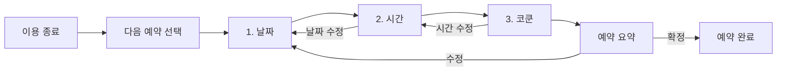
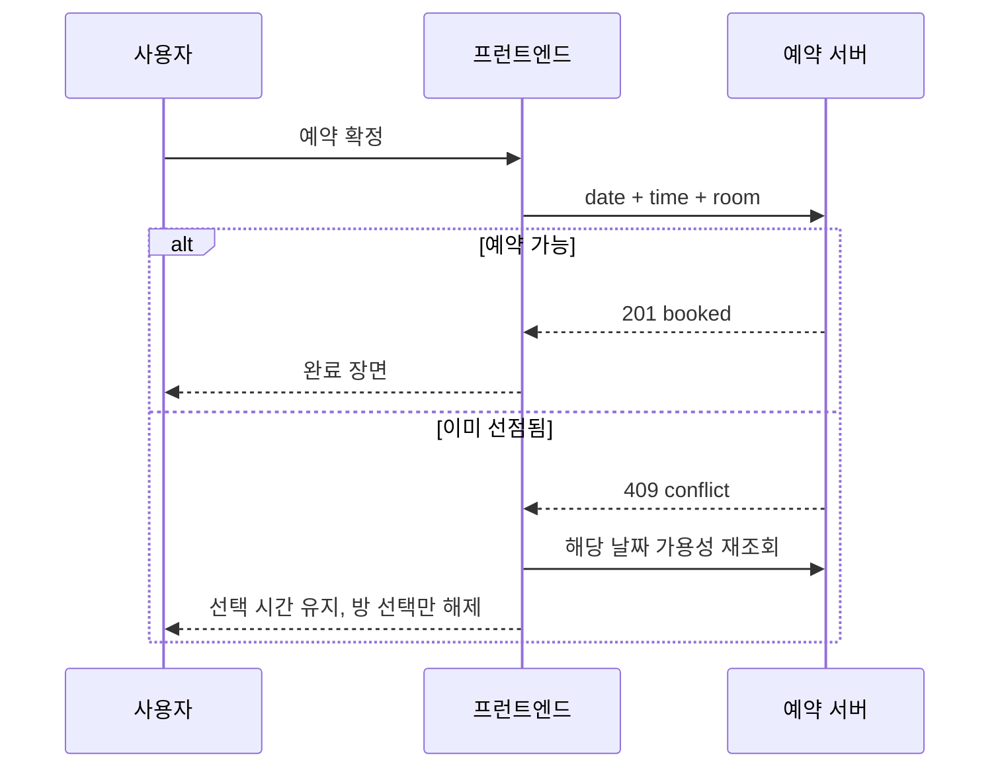

# 다음 예약 UX 상세 설계

> 대상 화면: 예약 이용시간 종료 후 다음 예약 일정 잡기
> 핵심 흐름: **날짜 선택 → 시간 선택 → 이용 가능한 코쿤 선택 → 예약 확인**
> 작성일: 2026-09-03

이 문서는 `COCOON_3D_BOOKING_DEMO_DESIGN.md`의 3D 자산·장면 설계를 확장하되, 화면 구조와 사용자 흐름은 이 문서를 우선한다. 기존 문서의 처음부터 보이는 좌우 2단 구성은 코쿤 선택 단계에서만 사용한다.

## 1. 설계 결론

이 화면은 일반적인 예약 폼이 아니라, 사용자가 방금 끝낸 경험에서 다음 경험으로 자연스럽게 이동하는 **짧은 인터랙티브 시퀀스**로 만든다.

핵심 인상은 다음 한 문장이다.

> “달력에서 고른 시간이 실제 코쿤 공간으로 이어지는 과정이 한 편의 짧은 영상처럼 자연스럽다.”

화려한 3D가 목표는 아니다. 사용자가 지금 무엇을 골랐고 다음에 무엇을 해야 하는지를 읽지 않고도 알 수 있어야 한다. 모든 모션은 다음 세 가지 중 하나를 설명해야 한다.

1. 내가 방금 무엇을 선택했는가
2. 다음에 무엇을 선택해야 하는가
3. 예약 결과가 실제 어느 공간과 연결되는가

## 2. 참고 기술의 역할

| 참고 | 적용할 부분 | 적용하지 않을 부분 |
|---|---|---|
| Manim | 한 장면의 오브젝트가 사라지지 않고 다음 장면의 오브젝트로 변형되는 연속성, 카메라의 시선 유도, 정보의 순차 등장 | 브라우저 런타임 UI. Manim은 사전 렌더 영상용이므로 클릭·키보드·실시간 가용성 갱신에는 사용하지 않는다. |
| 21st.dev / Motion Primitives | 공유 요소 전환, Morphing Popover, Transition Panel, 선택 표시가 이동하는 탭 패턴, 소스 단위 참고 | 여러 제작자의 컴포넌트를 그대로 섞어 일관성을 잃는 방식 |
| MotionSites | 깊이감 있는 배경 조명, 재질감, 큰 장면의 분위기와 화면 진입 연출 | 랜딩 페이지식 과도한 스크롤 효과, 예약 정보보다 강한 장식 |
| Anime.js | 타임라인과 stagger의 사고방식, SVG 경로 애니메이션 아이디어 | 1차 구현 의존성. 현재 프로젝트의 Motion + R3F로 같은 목적을 달성할 수 있다. |
| Motion (`framer-motion`) | DOM 레이아웃 전환, `layoutId`, `AnimatePresence`, 패널 교체, reduced-motion 대응 | 3D 오브젝트의 프레임별 움직임 |
| React Three Fiber + Three.js | 코쿤 공간의 깊이, 선택 가능한 방의 공간적 위치, 카메라 이동, 조명 및 재질 | 달력·시간·확정 버튼 같은 핵심 입력 UI |

### 기술 결론

- UI 애니메이션의 단일 소유자는 Motion으로 한다.
- 3D 장면 내부 움직임은 R3F `useFrame`과 감쇠 보간으로 처리한다.
- Anime.js는 추가하지 않는다. 두 타임라인 엔진이 같은 DOM을 제어하면 취소·재진입·접근성 처리가 복잡해진다.
- Manim은 나중에 홍보 영상 또는 튜토리얼 영상이 필요할 때만 사용한다.
- 21st.dev는 복사 대상이 아니라 상호작용 패턴 참고처로 사용한다.

## 3. UX 구조

### 3.1 전체 흐름



각 단계가 끝날 때 이전 패널을 완전히 없애지 않는다. 이전 선택은 상단의 작은 **선택 리본**으로 축약된다. 이 리본이 다음 단계로 이동하는 시각적 기준점이 된다.

예:

```text
┌ 1 날짜 ────────────┐       ┌ 2 시간 ─────────────┐
│ 9월 8일 화요일      │  →    │ 14:30 – 15:00       │
└────────────────────┘       └─────────────────────┘
```

완료된 리본은 클릭하면 해당 단계로 돌아간다. 뒤로 갔을 때 이후 선택은 다음 규칙으로 처리한다.

- 날짜를 바꾸면 시간과 코쿤 선택을 초기화한다.
- 이용 시간을 30분↔60분으로 바꾸면 시간과 코쿤 선택을 초기화한다.
- 시간만 바꾸면 코쿤 선택만 초기화한다.
- 현재 선택이 새 가용성에도 유효한 경우 자동 유지하지 않는다. 사용자가 변경 결과를 명확히 인지하도록 다시 선택하게 한다.

### 3.2 진행 표시

상단에 `날짜 · 시간 · 코쿤` 3단계 스테퍼를 고정한다.

| 상태 | 표시 |
|---|---|
| 대기 | 숫자 외곽선 + 중간 회색 텍스트 |
| 현재 | 코발트 원 + 흰 숫자 + 진한 제목 |
| 완료 | 체크 아이콘 + 선택 결과 한 줄 |
| 오류 | 붉은 외곽선 + 해당 단계 아래 인라인 메시지 |

스테퍼 자체를 거대한 탐색 메뉴로 만들지 않는다. 화면의 주인공은 현재 선택 영역이다.

## 4. 화면 콘셉트: Spatial Time Ribbon

### 4.1 시각적 방향

**Aesthetic:** 따뜻한 건축 모형 위에 정밀한 디지털 인터페이스가 얹힌 느낌
**Decoration:** 의도적인 수준. 얕은 그레인, 부드러운 광원, 선택 경로만 강조
**Layout:** 단계별 집중형 + 마지막 공간 단계에서만 3D 확장
**Motion:** 기능을 설명하는 시네마틱 모션

기존 화면의 따뜻한 아이보리 `#FBF8F4`는 유지한다. 차가운 SaaS 대시보드가 아니라 실제 교육센터의 공간을 예약하는 경험이기 때문이다. 주 선택 색상은 기존 파란색을 더 깊고 안정적인 코발트로 정리한다.

### 4.2 색상 토큰

```css
--booking-canvas: #EEEAE4;
--booking-surface: #FBF8F4;
--booking-surface-raised: #FFFFFF;
--booking-ink: #15243A;
--booking-ink-muted: #6E6A63;
--booking-line: #DED8CF;

--booking-primary: #2155D9;
--booking-primary-hover: #1746BE;
--booking-primary-soft: #E8EEFF;
--booking-primary-glow: rgba(33, 85, 217, 0.22);

--booking-accent: #C8734D;
--booking-accent-soft: #F5E9E2;

--booking-success: #16815D;
--booking-success-soft: #E4F4ED;
--booking-warning: #A96112;
--booking-warning-soft: #FFF2D8;
--booking-danger: #C43D3D;
--booking-danger-soft: #FDEAEA;
--booking-disabled: #C9C5BF;
```

색상은 상태를 보조할 뿐 상태의 유일한 표현이 아니다. 예약 가능 수, `마감`, `휴관`, 체크 아이콘, 취소선 등 텍스트·형태를 함께 사용한다.

### 4.3 타이포그래피

현재 프로젝트의 한국어 폰트 로딩 전략을 유지하면서 다음 역할을 명확히 한다.

| 역할 | 크기 / 행간 | 굵기 | 규칙 |
|---|---:|---:|---|
| 화면 제목 | 32 / 42px | 800–900 | 한 줄 원칙 |
| 단계 질문 | 26 / 36px | 800 | `언제 다시 이용하시겠어요?` |
| 월 제목 | 20 / 28px | 800 | 탭형 숫자 사용 |
| 날짜 숫자 | 17 / 24px | 700 | 터치 영역과 숫자 크기를 분리 |
| 시간 | 20 / 26px | 800 | 시간 숫자가 가장 먼저 보이게 |
| 보조 정보 | 14 / 21px | 600 | 가용 코쿤 수, 종료 시각 |
| 미세 레이블 | 12 / 18px | 700 | 단계 번호, 범례 |

영문·숫자 표시에는 `font-variant-numeric: tabular-nums`를 적용해 시간 카드가 흔들리지 않게 한다.

### 4.4 공간·모서리·그림자

- 기본 간격 단위: 4px
- 주요 간격: 8, 12, 16, 24, 32, 40, 48px
- 버튼 최소 높이: 52px
- 날짜 셀 최소 크기: 48×48px, 키오스크 권장 56×56px
- 카드 radius: 16px
- 주 패널 radius: 28px
- 선택 pill radius: 999px
- 주 패널 그림자: `0 30px 90px rgba(21, 36, 58, 0.18)`
- 선택 카드 그림자: `0 10px 28px rgba(33, 85, 217, 0.18)`

모든 요소를 둥글게 만들지 않는다. 날짜 셀은 12px, 시간 카드는 14px, 패널만 28px로 위계를 만든다.

## 5. 전체 레이아웃

### 5.1 데스크톱·키오스크 (1024px 이상)

```text
┌──────────────────────────────────────────────────────────────────────┐
│ 다음 예약을 잡아볼까요?                           닫기/이용 마치기   │
│  ● 날짜 ───────── ○ 시간 ───────── ○ 코쿤                          │
├──────────────────────────────────────────────────────────────────────┤
│                                                                      │
│                    언제 다시 이용하시겠어요?                         │
│                                                                      │
│  ┌────────────────────────────────────────────────────────────────┐  │
│  │  ‹         2026년 9월          ›                              │  │
│  │  일   월   화   수   목   금   토                              │  │
│  │  ...                       8 가능한 시간 6개 ...                │  │
│  └────────────────────────────────────────────────────────────────┘  │
│                                                                      │
│  범례  ● 여유   ◐ 얼마 안 남음   × 마감             [다음: 시간]  │
└──────────────────────────────────────────────────────────────────────┘
```

- 예약 모달 최대 너비: 1120px
- 최대 높이: 92dvh
- 콘텐츠 폭: 960px
- 달력 단계에서는 한 열 중앙 정렬
- 시간 단계에서는 왼쪽 선택 리본 260px + 오른쪽 시간 그리드
- 코쿤 단계에서는 왼쪽 320px 정보 패널 + 오른쪽 3D 뷰포트

단계에 따라 레이아웃이 넓어지는 것이 핵심이다. 달력부터 3D를 보여주면 사용자는 아직 쓸 수 없는 공간을 먼저 보게 되고 시선이 분산된다.

### 5.2 태블릿 (768–1023px)

- 모달 좌우 여백 20px
- 날짜 셀 48px 이상 유지
- 시간 카드 3열
- 코쿤 단계는 3D 위, DOM 방 선택 버튼 아래
- 3D 뷰포트 높이 330px

### 5.3 소형 화면

- 전체 화면 시트로 전환하고 모서리를 제거한다.
- 상단 스테퍼와 하단 CTA를 sticky로 고정한다.
- 달력 날짜 셀 최소 44px
- 시간 카드 2열
- 3D 뷰포트 높이 260px
- 세로 스크롤이 생겨도 현재 질문과 CTA를 동시에 잃지 않게 한다.

## 6. 단계 1: 날짜 선택

### 6.1 진입 화면

질문: **“언제 다시 이용하시겠어요?”**
보조 문구: “오늘부터 한 달 이내의 날짜를 선택해 주세요.”

`input type="date"`는 제거하고 한 달 달력을 항상 펼쳐 보여준다. 사용자가 날짜 입력 형식을 이해할 필요가 없고, 휴관일과 남은 예약량을 비교할 수 있어야 하기 때문이다.

### 6.2 달력 헤더

```text
[‹ 이전 달]              2026년 9월              [다음 달 ›]
```

- 예약 가능 범위 밖으로 이동하는 월 버튼은 disabled 처리한다.
- 현재 범위가 두 달에 걸치면 월 단위 이동을 허용한다.
- `오늘` 바로가기 버튼은 헤더 오른쪽 보조 액션으로 둔다.
- 요일은 `일 월 화 수 목 금 토`로 표시한다.

### 6.3 날짜 셀

날짜 셀에는 최대 세 계층만 보여준다.

```text
┌────────────┐
│  08   오늘 │
│  6개 가능  │
└────────────┘
```

| 상태 | 시각 표현 | 상호작용 |
|---|---|---|
| 오늘 | 우측 상단 `오늘` 배지, 얇은 코발트 외곽선 | 선택 가능 |
| 선택 | 코발트 배경, 흰 숫자, 체크 아이콘 | 다시 누르면 유지 |
| 여유 | `6개 가능`, 작은 녹색 점 | 선택 가능 |
| 얼마 안 남음 | `1개 남음`, 호박색 반원 | 선택 가능 |
| 마감 | 회색 배경, `마감`, 숫자 취소선 없음 | disabled |
| 휴관 | 옅은 사선 패턴, `휴관` | disabled |
| 범위 밖 | 투명도 30%, 보조 텍스트 없음 | disabled |
| 조회 중 | 셀 내부 2줄 skeleton | 월 전환만 잠금 |

마감 날짜에 취소선을 쓰지 않는 이유는 날짜 자체가 취소된 것이 아니라 예약이 꽉 찬 것이기 때문이다.

### 6.4 선택 동작

1. 날짜 셀을 누르면 선택 배경이 해당 셀로 180ms 동안 이동한다.
2. 선택 셀의 날짜 숫자가 상단 선택 리본으로 복제되는 듯 이동한다.
3. 달력 패널은 12px 축소되며 흐려지는 대신 높이가 줄어 선택 리본으로 정리된다.
4. 시간 패널이 아래에서 16px 올라오며 열린다.

날짜 선택 직후 자동으로 다음 단계로 이동한다. 별도 `다음` 버튼은 키오스크에서 중복 행동이므로 제거한다. 다만 스크린리더에는 “9월 8일 선택됨. 시간 선택 단계로 이동했습니다.”를 `aria-live="polite"`로 알린다.

### 6.5 가용성 API 요구

현재 API는 하루를 선택한 뒤에만 시간 목록을 반환한다. 달력에 날짜별 상태를 보여주려면 월/범위 요약 API가 필요하다.

```http
GET /reservation-session/availability-calendar
  ?from=2026-09-03
  &to=2026-10-03
  &durationMinutes=30
```

```json
{
  "from": "2026-09-03",
  "to": "2026-10-03",
  "days": [
    {
      "date": "2026-09-08",
      "status": "available",
      "availableSlotCount": 6,
      "minimumAvailableRoomCount": 2
    },
    {
      "date": "2026-09-09",
      "status": "closed",
      "availableSlotCount": 0,
      "message": "휴관일"
    }
  ]
}
```

`status`는 `available | limited | full | closed` 네 값으로 제한한다. 프런트엔드가 운영 규칙을 추론하지 않게 한다.

## 7. 단계 2: 시간 선택

### 7.1 상단 구조

```text
[✓ 9월 8일 화요일]                    이용 시간  [30분] [60분]
──────────────────────────────────────────────────────────────
어느 시간에 시작할까요?
```

이용 시간은 `<select>` 대신 30분/60분 segmented control로 보여준다. 선택지가 두 개뿐이라 숨겨진 메뉴보다 즉시 비교가 낫다.

### 7.2 시간 그룹

시간은 긴 pill 나열이 아니라 `오전 / 오후 / 저녁`으로 나눈 카드 그리드다.

```text
오전
┌──────────────┐ ┌──────────────┐ ┌──────────────┐
│ 10:30        │ │ 11:00        │ │ 11:30        │
│ → 11:00      │ │ → 11:30      │ │ → 12:00      │
│ 코쿤 3개     │ │ 코쿤 1개     │ │ 마감         │
└──────────────┘ └──────────────┘ └──────────────┘
```

| 요소 | 규칙 |
|---|---|
| 시작 시각 | 20px, 800, 첫 시선 |
| 종료 시각 | 13px, `→ 15:00` |
| 가용 방 수 | `코쿤 3개`, 방 아이콘 |
| 마감 | 카드 비활성 + `마감` 텍스트 |
| 임박 | `1개 남음` 호박색 배지 |
| 선택 | 코발트 외곽선 2px + 옅은 배경 + 체크 |

30분 간격을 유지한다. 카드 전체가 최소 96×76px 터치 영역이 되게 한다.

### 7.3 선택 동작

1. 시간 카드를 누르면 선택 외곽선이 `layoutId="selected-time"`으로 이동한다.
2. 카드 내부의 `코쿤 N개` 배지가 오른쪽 공간 단계 제목 옆으로 이동한다.
3. 나머지 시간 카드의 대비가 85%로 낮아지고 선택 카드만 전경으로 올라온다.
4. 3D 장면은 흰 배경에서 갑자기 등장하지 않는다. 공간 윤곽선이 2D 평면도처럼 먼저 그려지고 500ms 동안 높이가 생기며 3D로 전환된다.

이 연출이 Manim에서 차용하는 핵심이다. 서로 무관한 화면을 컷 전환하지 않고, 같은 정보가 형태를 바꾸어 다음 화면이 된다.

### 7.4 빈 상태

- 모든 시간이 마감: “이 날짜는 예약 가능한 시간이 없어요.” + `다른 날짜 보기`
- 일부 시간만 마감: 마감 카드를 숨기지 않고 위치를 유지한다. 사용자는 운영 시간의 전체 맥락을 볼 수 있다.
- 재조회 중: 기존 목록을 즉시 지우지 않고 55% 투명도 + 상단 얇은 progress bar
- 조회 실패: 패널 내부에 `다시 불러오기`, 이전 날짜 선택은 유지

## 8. 단계 3: 코쿤 선택

### 8.1 화면 구조

```text
┌──────────────────────────┬────────────────────────────────────┐
│ ✓ 9월 8일 화요일         │                                    │
│ ✓ 14:30–15:00            │       고정 카메라 3D 조감도        │
│                          │                                    │
│ 어느 코쿤을 이용할까요?  │     [1]     [2]                    │
│                          │         [3]     [4]                │
│ [코쿤 1]  예약 가능      │                                    │
│ [코쿤 2]  예약 가능      │                                    │
│ [코쿤 3]  이용 중        │                                    │
│ [코쿤 4]  예약 가능      │                                    │
│                          │                                    │
│      [이 일정으로 예약]  │                                    │
└──────────────────────────┴────────────────────────────────────┘
```

3D Canvas는 공간 이해를 돕는 두 번째 표현이다. 접근 가능한 DOM 버튼이 항상 왼쪽에 있으며 키보드·스크린리더 사용자는 3D 없이 전체 예약을 끝낼 수 있다.

### 8.2 3D 아트 디렉션

**스타일:** 실제 건축 렌더보다 정교한 미니어처 모형
**배경:** 따뜻한 회백색 무한 바닥
**재질:** 무광 아이보리 외장 + 짙은 남색 프레임 + 반투명 문
**조명:** 좌상단 큰 area light, 우측 약한 fill, 선택 코쿤 아래 코발트 bounce
**카메라:** 35–45도 조감, 고정된 원근, 자유 회전·줌 없음

배경에는 매우 느린 그레인 또는 광량 변화만 허용한다. 눈에 보이는 무한 회전, 떠다니는 입자, 강한 bloom, 과도한 유리 효과는 금지한다.

### 8.3 방 상태

| 상태 | 모델 표현 | DOM 표현 |
|---|---|---|
| 예약 가능 | 정상 채도, 문 상단 얇은 녹색 라인 | `예약 가능` |
| hover/focus | 1.015배, 4cm 상승, 번호 라벨 선명 | 코발트 외곽선 |
| 선택 | 1.02배, 바닥 코발트 링, 내부 조명 켜짐 | 코발트 배경 + 체크 |
| 이용 불가 | 채도 15%, 내부 조명 꺼짐 | disabled + `이용 중` |
| 데이터 불명 | 와이어프레임 윤곽, 회색 | `확인 중` |

선택된 방만 카메라가 4–6% 가까워진다. 사용자가 여러 번 방을 바꿔도 카메라가 매번 크게 움직이지 않도록 첫 선택에만 전체 이동을 적용하고 이후에는 타깃 보간만 한다.

### 8.4 양방향 동기화

- DOM 버튼 hover/focus → 같은 코쿤 강조
- 3D 코쿤 hover → 같은 DOM 버튼 강조
- DOM 버튼 click/Enter/Space → 같은 선택 함수 호출
- 3D 코쿤 click/tap → 같은 선택 함수 호출
- 최종 선택 상태는 `selectedRoomId` 하나만 진실의 원천으로 둔다.

## 9. 예약 요약과 확정

코쿤을 선택하면 별도 페이지로 컷 전환하지 않는다. 왼쪽 정보 패널 하단이 확장되어 예약 요약이 된다.

```text
다음 예약
9월 8일 화요일
14:30 – 15:00 · 30분
코쿤 2번

[이 일정으로 예약]
날짜 또는 시간 수정
```

- CTA 문구는 `예약하기`보다 구체적인 `이 일정으로 예약`을 유지한다.
- CTA 위에 날짜·시간·코쿤을 모두 다시 보여준다.
- 수정 링크는 선택 리본으로 포커스를 이동한다.
- 요청 중에는 버튼 너비를 고정하고 `예약 확인 중…` + spinner를 표시한다.
- 중복 클릭을 막되 전체 UI를 흐리게 하지 않는다.

### 완료 장면

1. 선택된 코쿤의 내부 조명이 켜진다.
2. 바닥 선택 링이 한 번 넓어졌다 사라진다.
3. 3D 코쿤이 2D 완료 카드의 작은 아이콘 위치로 축약된다.
4. 체크가 그려지고 “다음 예약이 완료되었습니다”가 나타난다.
5. 10초 후 복귀 카운트다운과 `지금 돌아가기` 버튼을 함께 제공한다.

완료 애니메이션은 총 700ms를 넘기지 않는다. 사용자가 성공 여부를 기다리는 느낌을 주면 안 된다.

## 10. 모션 시스템

### 10.1 원칙

1. **연속성:** 이전 선택의 위치나 형태가 다음 장면의 시작점이 된다.
2. **한 번에 한 초점:** 같은 순간에 두 개 이상의 큰 요소가 움직이지 않는다.
3. **짧은 반응, 긴 장면:** 버튼 반응은 80–160ms, 패널 전환은 220–360ms, 3D 장면 전환만 최대 650ms.
4. **감쇠 정지:** 3D 오브젝트는 overshoot 없이 안정적으로 멈춘다.
5. **항상 취소 가능:** 단계 변경·모달 종료 시 진행 중 애니메이션을 즉시 정리한다.

### 10.2 모션 토큰

```ts
export const bookingMotion = {
  duration: {
    press: 0.09,
    micro: 0.16,
    selection: 0.22,
    panel: 0.32,
    scene: 0.58,
    success: 0.68,
  },
  ease: {
    enter: [0.22, 1, 0.36, 1],
    move: [0.4, 0, 0.2, 1],
    exit: [0.4, 0, 1, 1],
  },
  spring: {
    selection: { stiffness: 420, damping: 34, mass: 0.8 },
    panel: { stiffness: 300, damping: 32, mass: 0.95 },
  },
};
```

### 10.3 타임라인

| 이벤트 | 0ms | 80ms | 180ms | 320ms | 580ms |
|---|---|---|---|---|---|
| 날짜 선택 | press | 선택 배경 이동 | 날짜가 리본으로 이동 | 시간 패널 등장 | 완료 |
| 시간 선택 | press | 외곽선 이동 | 방 수 배지 이동 | 평면도 등장 | 3D 높이 형성 |
| 코쿤 선택 | press | 바닥 링 점등 | 모델 4cm 상승 | 요약 확장 | 카메라 정착 |
| 예약 완료 | 버튼 잠금 | 내부 조명 | 성공 링 | 완료 카드 변형 | 체크 완료 |

시간 카드 stagger는 항목당 18ms, 최대 총 140ms로 제한한다. 항목이 많아도 마지막 항목이 늦게 나타나지 않게 한다.

### 10.4 reduced motion

`prefers-reduced-motion: reduce`에서는 다음처럼 바꾼다.

- 위치 이동과 scale 제거
- 3D 카메라 이동 제거
- 평면→입체 변형 제거
- 100–140ms opacity 전환만 유지
- 자동으로 움직이는 배경·그레인 정지

정보 순서와 선택 결과는 동일해야 하며 애니메이션을 끈다고 기능이 사라지면 안 된다.

## 11. 마이크로카피

| 상황 | 문구 |
|---|---|
| 예약 진입 | `다음 예약을 잡아볼까요?` |
| 날짜 질문 | `언제 다시 이용하시겠어요?` |
| 시간 질문 | `어느 시간에 시작할까요?` |
| 코쿤 질문 | `어느 코쿤을 이용할까요?` |
| 날짜 가용 | `예약 가능한 시간 6개` |
| 날짜 제한 | `가능한 시간이 1개 남았어요` |
| 시간 가용 | `코쿤 3개` |
| 모두 마감 | `이 날짜는 예약 가능한 시간이 없어요.` |
| 로딩 | `가능한 시간을 확인하고 있어요…` |
| 재조회 | `새로운 예약 가능 여부를 확인하고 있어요…` |
| 충돌 409 | `방금 다른 예약이 먼저 확정됐어요. 가능한 시간을 다시 보여드릴게요.` |
| 확정 | `이 일정으로 예약` |
| 완료 | `다음 예약이 완료되었습니다` |

`오류가 발생했습니다`, `유효하지 않습니다` 같은 시스템 문구는 사용하지 않는다. 사용자가 다음에 할 수 있는 행동을 함께 말한다.

## 12. 로딩·오류·경합 처리

### 12.1 월 가용성 로딩

- 달력 골격은 즉시 표시한다.
- 이전/다음 월 이동 시 셀 위치를 유지한다.
- 데이터가 도착하면 셀 상태만 120ms fade로 갱신한다.

### 12.2 일별 시간 로딩

- 날짜 리본을 먼저 확정한다.
- 시간 패널은 skeleton 카드 8개를 고정 높이로 보여준다.
- 응답 후 실제 카드가 같은 위치에서 교체된다.

### 12.3 예약 충돌

예약 제출과 실제 확정 사이에 다른 사용자가 같은 코쿤을 예약할 수 있다.



409에서는 사용자를 처음 달력으로 돌려보내지 않는다. 선택 시간에 다른 방이 있으면 코쿤 단계에서 대안을 바로 보여준다. 선택 시간 전체가 마감된 경우에만 시간 단계로 돌아간다.

## 13. 접근성

- 모달 열림 시 제목으로 포커스를 이동하고 닫힐 때 원래 버튼으로 복귀한다.
- 달력은 `grid`/`gridcell` 키보드 패턴을 사용한다.
- 방향키는 일 단위, Home/End는 주의 시작·끝, PageUp/PageDown은 월 이동으로 동작한다.
- 선택 가능한 날짜 하나만 roving `tabIndex=0`을 가진다.
- 모든 입력은 최소 44×44px이며 키오스크에서는 52px 이상을 권장한다.
- 포커스 링은 3px 코발트 + 2px 아이보리 간격으로 밝고 어두운 배경 모두에서 보인다.
- 현재 단계, 선택 완료, 오류, 로딩 완료를 적절한 `aria-live`로 알린다.
- 3D Canvas는 `aria-hidden="true"`로 두고 동일 기능을 DOM 버튼으로 제공한다.
- 방 상태는 색상만으로 표현하지 않는다.
- 자동 복귀 카운트다운은 사용자가 중단하거나 즉시 복귀할 수 있어야 한다.

## 14. 컴포넌트 구조

```text
ReservationEndOverlay
└─ FollowupBookingFlow
   ├─ BookingHeader
   │  ├─ BookingStepper
   │  └─ SelectionRibbon
   ├─ DateStep
   │  ├─ DurationSegment
   │  ├─ AvailabilityCalendar
   │  ├─ CalendarDay
   │  └─ CalendarLegend
   ├─ TimeStep
   │  ├─ TimePeriodGroup
   │  └─ TimeSlotCard
   ├─ RoomStep
   │  ├─ RoomChoiceList
   │  ├─ CocoonScene
   │  │  ├─ CocoonRoom
   │  │  ├─ RoomLabel
   │  │  └─ SceneLighting
   │  └─ BookingSummary
   ├─ BookingSuccess
   └─ BookingError
```

`ReservationEndOverlay`에 모든 렌더링을 계속 쌓지 않는다. 네트워크 상태와 예약 상태는 상위 흐름이 소유하고, 달력·시간 카드·3D 장면은 명시적인 props로만 제어한다.

### 상태 모델

```ts
type BookingStep = 'date' | 'time' | 'room' | 'submitting' | 'success';

type BookingDraft = {
  durationMinutes: 30 | 60;
  date: string | null;
  slot: AvailabilitySlot | null;
  room: AvailableRoom | null;
};
```

단계를 여러 boolean으로 추론하지 않고 `BookingStep`으로 명시한다. 가능한 상태와 화면이 일치해 테스트하기 쉬워진다.

## 15. 라이브러리 결정

### 달력

1차 권장안은 `@daypicker/react`를 사용해 달력 구조·키보드 이동·날짜 계산을 맡기고, 날짜 셀과 캡션은 이 설계에 맞게 완전히 커스텀하는 것이다.

- 장점: 월 그리드와 날짜 선택을 직접 다시 구현하지 않아도 된다.
- 조건: 현재 프로젝트 React 19/Next 16 호환성을 설치 전에 확인한다.
- 대안: React Aria Calendar. 국제화와 접근성은 강하지만 이 화면 하나를 위해 가져올 범위가 더 크다.
- 비권장: 공개 예약 사이트의 Ant Design Calendar를 그대로 가져오기. 별도 앱의 무거운 디자인 시스템이 현재 화면과 충돌한다.

### 애니메이션

- Motion: `layout`, `layoutId`, `AnimatePresence`, `useReducedMotion`
- R3F: `useFrame`, `MathUtils.damp`, pointer events
- Anime.js: 추가하지 않음
- Manim: 런타임 미사용

## 16. 성능 예산

| 항목 | 목표 |
|---|---:|
| 달력→시간 반응 | 입력 후 100ms 안에 시각 피드백 |
| 일별 가용성 응답 목표 | p95 700ms 이하 |
| 3D 첫 표시 | 시간 선택 후 900ms 안에 유효 장면 |
| 3D 프레임 | 운영 키오스크에서 45fps 이상, 목표 60fps |
| GLB 압축 크기 | 2MB 이하 |
| 드로우콜 | 60 이하 |
| 텍스처 | 최대 2048px, 모바일/키오스크 상황별 축소 |
| 레이아웃 이동 | CLS 0.05 이하 |

WebGL 생성 실패, GPU 성능 부족, reduced motion 환경에서는 정적 조감도 또는 CSS 평면도로 대체한다. 예약 기능 자체는 동일해야 한다.

## 17. 분석 이벤트

화려함이 아니라 실제 예약 완료가 개선됐는지 확인한다.

```text
followup_booking_opened
followup_date_selected
followup_duration_changed
followup_time_selected
followup_room_selected
followup_booking_submitted
followup_booking_succeeded
followup_booking_conflict
followup_step_back
followup_booking_abandoned
```

측정 지표:

- 예약 진입→완료 전환율
- 단계별 이탈률
- 각 단계 평균 소요 시간
- 날짜 변경 횟수
- 마감 날짜 클릭 시도 수
- 409 충돌 후 회복 성공률
- 3D 선택과 DOM 선택 비율
- reduced-motion/3D fallback 환경의 완료율 차이

## 18. 구현 순서

### Phase 1: 정보 구조와 2D UX

- 화면을 단계 상태 머신으로 분리
- inline 달력
- 30/60분 segmented control
- 그룹형 시간 카드
- 선택 리본과 예약 요약
- 월 가용성 API
- 접근성·키보드·오류 처리

이 단계만으로도 현재 텍스트 중심 UX의 핵심 문제를 해결한다.

### Phase 2: 연속 모션

- 선택 배경 `layoutId`
- 날짜/시간의 선택 리본 전환
- 패널 진입·복귀
- 성공 상태 morph
- reduced-motion 분기

### Phase 3: 코쿤 3D 데모

- 기본 도형으로 코쿤 4개 배치
- DOM↔3D hover/focus/select 동기화
- 평면도→입체 전환
- 카메라와 조명 튜닝
- WebGL fallback

### Phase 4: 최종 3D 자산

- 실제 배치·건축 모델 수급
- Blender 정리 및 Draco/meshopt 압축
- PBR 재질과 라이트맵
- 운영 기기 성능 검증

## 19. 완료 판정 기준

- 예약 진입 후 사용자는 텍스트 입력 없이 날짜를 선택할 수 있다.
- 날짜 선택 전에는 시간과 코쿤을 선택할 수 없다.
- 시간 선택 전에는 코쿤을 선택할 수 없다.
- 모든 날짜 셀은 여유/임박/마감/휴관 상태를 색상 외 방식으로 구분한다.
- 날짜 선택 후 400ms 이내에 시간 단계가 읽을 수 있는 상태로 나타난다.
- 시간 카드에 시작·종료·가용 코쿤 수가 함께 보인다.
- 3D를 끄거나 WebGL이 실패해도 예약을 완료할 수 있다.
- DOM과 3D의 방 hover/focus/select 상태가 250ms 이내에 동기화된다.
- 날짜 또는 이용 시간을 바꾸면 잘못된 후속 선택이 초기화된다.
- polling으로 동일 예약의 새 객체가 들어와도 사용 중인 선택이 불필요하게 사라지지 않는다.
- 409 충돌 후 가능한 대안 단계로만 한 단계 되돌아간다.
- 키보드만으로 모든 단계를 완료할 수 있다.
- reduced-motion에서도 정보와 기능이 동일하다.

## 20. 안전한 선택과 의도적인 위험

### 안전한 선택

- 항상 보이는 월 달력: 약속 예약에서 사용자가 기대하는 익숙한 모델이다.
- 단계별 흐름: 날짜·시간·공간의 의존관계를 그대로 반영한다.
- DOM 입력 유지: 3D 실패와 접근성 문제를 막는다.
- 30분 그리드: 현재 운영 슬롯과 일치하고 빠르게 스캔된다.

### 의도적인 위험

1. **시간 선택 후 평면도가 3D 공간으로 세워지는 전환**
   - 얻는 것: 날짜와 시간이 실제 공간으로 연결되는 기억에 남는 순간
   - 비용: R3F 장면 상태와 DOM 전환의 정교한 동기화 필요
   - 방어선: 650ms 상한, reduced-motion/fallback 제공

2. **단계가 바뀌어도 이전 선택이 리본으로 살아남는 구조**
   - 얻는 것: 사용자가 문맥을 잃지 않고 언제든 수정 가능
   - 비용: 레이아웃 전환과 포커스 관리가 일반 폼보다 복잡
   - 방어선: 단일 상태 머신과 `layoutId` 규칙 고정

3. **건축 모형 같은 따뜻한 3D 아트 디렉션**
   - 얻는 것: 일반 예약 서비스와 구별되는 장소성
   - 비용: 최종 자산 품질이 낮으면 장난감처럼 보일 수 있음
   - 방어선: 1차는 절차형 모형으로 상호작용 검증 후 실제 자산 교체

## 21. 참조

- [Manim Community](https://docs.manim.community/en/stable/)
- [21st.dev](https://21st.dev/)
- [Motion Primitives on 21st.dev](https://21st.dev/@ibelick/library/motion-primitives)
- [MotionSites](https://motionsites.ai/)
- [Anime.js](https://animejs.com/)
- [Motion layout animations](https://motion.dev/docs/react-layout-animations)
- [Motion useReducedMotion](https://motion.dev/docs/react-use-reduced-motion)
- [React DayPicker](https://daypicker.dev/)
- [React Aria DatePicker](https://react-aria.adobe.com/DatePicker)
- [WAI-ARIA Date Picker Example](https://www.w3.org/WAI/ARIA/apg/patterns/dialog-modal/examples/datepicker-dialog/)
